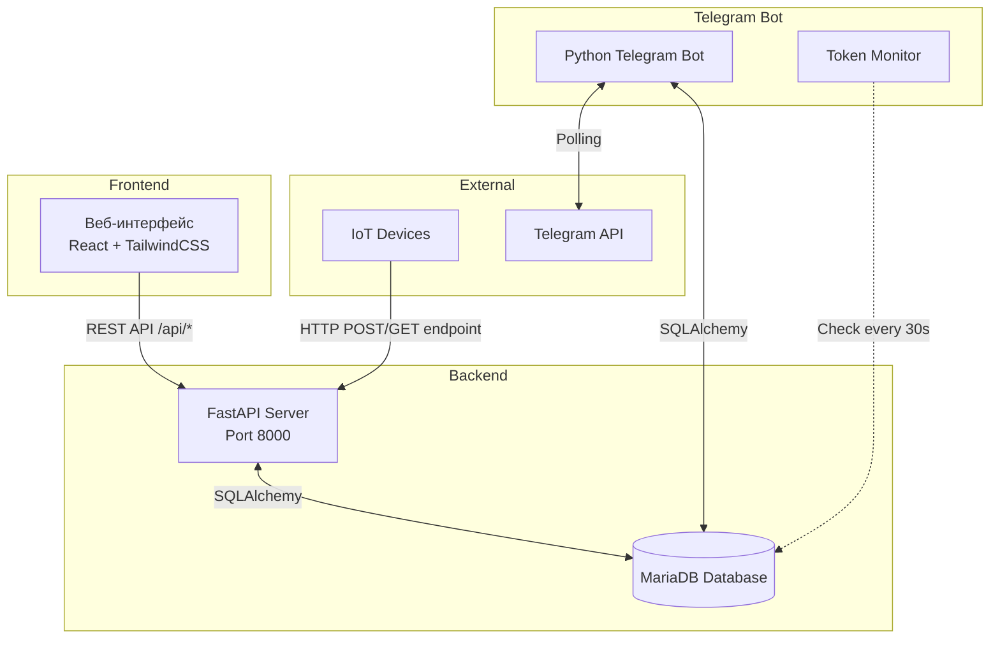

# 🌱 Plant Watering Monitoring System — Technical Wiki

Система мониторинга растений с Telegram-ботом, веб-интерфейсом и API для IoT-устройств.

---

## 1. 🌐 АРХИТЕКТУРА И ПОТОКИ ДАННЫХ

### 1.1 Описание проекта

Система предназначена для:
- 📊 Мониторинга данных с IoT-устройств (датчики влажности, температуры и т.д.)
- 🔔 Уведомления пользователей о состоянии устройств через Telegram
- 🖥️ Управления конфигурацией устройств и сборок через веб-интерфейс
- 🤖 Взаимодействия с пользователями через Telegram-бота

### 1.2 Схема взаимодействия компонентов



**Текстовый flow:**
```
IoT Device → HTTP Request → Nginx → Backend API → Database
                              ↓
                        Bot Manager ← Database (token)
                              ↓
                        Telegram API → User
                              
Web Browser → Nginx → Frontend Static → Backend API → Database
```

### 1.3 Протоколы передачи данных

| Компонент | Протокол | Описание |
|-----------|----------|----------|
| Web ↔ Backend | REST API (HTTP/JSON) | Все запросы через `/api/*` |
| IoT Devices ↔ Backend | HTTP POST/GET | Endpoint: `/{machine_name}/{device_id}/{post\|get}_endpoint` |
| IoT Devices ↔ Backend (Commands) | HTTP GET | Устройство опрашивает `/{machine_name}/{device_id}/get_endpoint`, получает команды в формате `{"commands": {"cmd1": "val1", ...}}` |
| Bot ↔ Database | SQLAlchemy (Direct SQL) | Чтение токена, настроек пользователей, запись команд в device_commands |
| Bot ↔ Telegram | python-telegram-bot (Polling) | Long-polling для получения обновлений |
| Nginx ↔ Backend | HTTP Proxy | Reverse proxy для API и статики |

### 1.4 Стек технологий

| Компонент | Технология | Версия |
|-----------|------------|--------|
| **Backend** | FastAPI | 0.115.0 |
| | Python | 3.10 |
| | SQLAlchemy | 2.0.30 |
| | PyJWT | 2.8.0 |
| | PyMySQL | 1.1.0 |
| **Bot** | python-telegram-bot | 22.0 |
| | SQLAlchemy | 2.0.30 |
| | PyMySQL | 1.1.0 |
| **Frontend** | React | 18.2.0 (CDN) |
| | Axios | 1.5.0 (CDN) |
| | TailwindCSS | Latest (CDN) |
| | Babel Standalone | 7.22.5 (CDN) |
| **Database** | MariaDB | 10.6 |
| **Web Server** | Nginx | Latest |

### 1.5 Жизненный цикл типового запроса

#### Запрос от IoT устройства (POST — отправка данных):
```
1. Device → POST /{machine_name}/{device_id}/post_endpoint
2. Nginx → Проксирует на backend:8000
3. Backend → Валидирует JSON
4. Backend → get_or_create_device() — проверяет/создает устройство в БД
5. Backend → Сохраняет данные в device_data
6. Backend → Асинхронно: evaluate_device_scenarios() — проверка активных сценариев
7. Backend → Возвращает {status: "success", ...}
```

#### Автоматическое выполнение сценариев (после получения данных от устройства):
```
1. Backend → После сохранения данных в device_data
2. Backend → evaluate_device_scenarios(db, device_id, incoming_data) [асинхронно]
3. Backend → Находит все активные сценарии для build_id устройства
4. Backend → Для каждого сценария парсит flow_data и проверяет:
   - trigger: наличие поля в incoming_data
   - condition: сравнение значения (операторы: eq, ne, gt, lt, ge, le, contains)
   - day_filter: проверка текущего дня недели (0=Monday, 6=Sunday)
5. Backend → Если все условия выполнены → INSERT INTO device_commands (action)
6. Backend → Логирование: какой сценарий сработал, какая команда поставлена в очередь
7. [Device → GET /{machine_name}/{device_id}/get_endpoint → Получает команду]
```

#### Запрос от IoT устройства (GET — получение команд):
```
1. Device → GET /{machine_name}/{device_id}/get_endpoint
2. Nginx → Проксирует на backend:8000
3. Backend → get_or_create_device() — проверяет/создает устройство
4. Backend → Запрашивает невыполненные команды из device_commands
5. Backend → Формирует плоский JSON {commands: {cmd1: val1, cmd2: val2}}
6. Backend → Помечает команды как выполненные (is_executed = True)
7. Backend → Возвращает {status: "success", commands: {...}}
```

#### Действие пользователя в боте (отправка команды устройству):
```
1. User → Нажимает кнопку команды в Telegram (task_cmd_exec_...)
2. Bot → handle_task_command_execution() парсит callback_data
3. Bot → Извлекает device_id, command, value
4. Bot → INSERT INTO device_commands (device_id, command, value, is_executed=0)
5. Bot → Отправляет подтверждение пользователю
6. [Device → GET /{machine_name}/{device_id}/get_endpoint → Получает команду]
```

#### Действие пользователя в боте (общий flow):
```
1. User → Нажимает кнопку в Telegram
2. Telegram API → Отправляет callback_query боту
3. Bot → handle_device_callback() обрабатывает callback_data
4. Bot → DeviceService → SQL запрос к БД
5. Bot → Формирует ответное сообщение
6. Bot → Отправляет ответ через Telegram API
```

#### Запрос от веб-интерфейса:
```
1. User → Кликает кнопку в UI
2. Frontend → axios.post('/api/auth/login', {...})
3. Nginx → Проксирует на backend:8000/api/auth/login
4. Backend → Проверяет credentials в БД
5. Backend → Генерирует JWT токен
6. Backend → Возвращает {token: "..."}
7. Frontend → Сохраняет токен в localStorage
```

---

## 2. 🤖 TELEGRAM-БОТ

### 2.1 Роль в системе

Бот выступает как интерфейс пользователя для:
- Просмотра списка подключенных устройств
- Добавления/удаления устройств из персонального списка
- Управления настройками уведомлений
- Получения статусов онлайн/оффлайн устройств

**Интеграции:**
- **База данных**: Прямое подключение через SQLAlchemy (чтение/запись)
- **Сервер**: [TODO: уточнить из кода — прямых вызовов API сервера не обнаружено]
- **Сайт**: Косвенная связь через общую БД (настройки токена, пользовательские данные)

### 2.2 Команды бота

| Команда | Scope | Описание | Права/Фильтры |
|---------|-------|----------|---------------|
| `/start` | Global | Запуск бота, показ приветствия с клавиатурой | Все пользователи |
| `/help` | Global | Показать список доступных команд | Все пользователи |
| `/status` | Global | Проверка статуса работы бота | Все пользователи |
| `/devices` | Global | Список устройств пользователя | Все пользователи |
| `/add_device` | Global | Начало процесса добавления устройства | Все пользователи |
| `/remove_device` | Global | Список устройств для удаления | Все пользователи |
| `/start_notifications` | Global | Включение уведомлений | Все пользователи |
| `/stop_notifications` | Global | Выключение уведомлений | Все пользователи |
| `/test_notification` | Global | Отправка тестового уведомления | Все пользователи |

### 2.3 Обработчики (Handlers)

| Файл/Модуль | Тип | Входные данные | Бизнес-логика | Выход/Ответ | Вызовы сервера/БД |
|-------------|-----|----------------|---------------|-------------|-------------------|
| `handlers/commands.py` | | | | | |
| `help_command` | message | Update, Context | Формирование текста справки | Текст с командами | Нет |
| `status_command` | message | Update, Context | Проверка статуса | "✅ Бот работает" | Нет |
| `handlers/menu_handlers.py` | | | | | |
| `start_command` | message | Update, Context | Приветствие + ReplyKeyboard | Текст + главное меню (📊 Данные, 📝 Задачи, ⚙️ Настройки) | Нет |
| `handle_main_menu` | message (filter) | Text="⚙️ Настройки" | Показ inline меню настроек | InlineKeyboard: Уведомления, Устройства | Нет |
| `handle_data_section` | message (filter) | Text="📊 Данные" | Показ заглушки раздела данных | Текст: "Раздел данных: здесь будет агрегироваться история показаний датчиков, статусы устройств и аналитика. Функционал в разработке." + главное меню | Нет |
| `handle_tasks_section` | message (filter) | Text="📝 Задачи" | Показ заглушки раздела задач | Текст: "Раздел задач: здесь появится управление расписанием, автоматические сценарии и журнал действий. Функционал в разработке." + главное меню | Нет |
| `handle_menu_callback` | callback_query | pattern: `^menu_`, `^enable_`, `^disable_`, `^devices_` | Навигация по меню настроек | Edit message с новым контентом | NotificationService (БД) |
| `handlers/device_handlers.py` | | | | | |
| `devices_list_command` | command/callback | Update, Context | Получение списка устройств | Список устройств с кнопками | DeviceService → БД |
| `add_device_command` | command/callback | Update, Context | Установка состояния 'waiting_for_device_id' | Запрос ID устройства | Нет |
| `handle_device_id_input` | message (text filter) | Text (число) | Валидация и сохранение устройства | Подтверждение/ошибка | DeviceService → БД |
| `remove_device_command` | command/callback | Update, Context | Список устройств для удаления | Кнопки подтверждения | DeviceService → БД |
| `handle_device_callback` | callback_query | pattern: device_* | Обработка всех device callback'ов | Различные ответы | DeviceService → БД |
| `handlers/notification_handlers.py` | | | | | |
| `start_notifications_command` | command | Update, Context | Включение уведомлений | Подтверждение | NotificationService → БД |
| `stop_notifications_command` | command | Update, Context | Выключение уведомлений | Подтверждение | NotificationService → БД |
| `test_notification_command` | command | Update, Context | Отправка тестового сообщения | Тестовое уведомление | NotificationService → БД |
| `handlers/data_handlers.py` | | | | | |
| `handle_data_list` | callback_query | pattern: `^data_list_p\d+` | Пагинация списка устройств пользователя | InlineKeyboard: устройства, ◀️, ▶️ | Database → user_devices, devices |
| `handle_device_select` | callback_query | pattern: `^data_dev_\d+_\d+` | Загрузка датчиков устройства | Заголовок + список датчиков (пагинация) | Database → builds.post_fields, device_data |
| `handle_field_select` | callback_query | pattern: `^data_field_\d+_\d+_.+` | Получение последних 20 показаний датчика | Текст: 🕒 timestamp \| 📏 value (список) + кнопки Excel/Анализ | Database → device_data |
| `handle_fields_pagination` | callback_query | pattern: `^data_fields_\d+_\d+_p\d+` | Пагинация списка датчиков | InlineKeyboard: датчики, ◀️, ▶️, 🔙 | Database → builds.post_fields, device_data |
| `handle_data_excel` | callback_query | pattern: `^data_excel_\d+_\d+_.+` | Генерация и отправка Excel-файла | Файл .xlsx + сообщение с кнопками навигации | Database → device_data |
| `handle_data_analyze` | callback_query | pattern: `^data_analyze_\d+_\d+_.+` | Генерация графика анализа | send_photo() с графиком + edit_message_text() исходного | Database → device_data, utils.data_charts.generate_analysis_chart() |
| `handlers/task_handlers.py` | | | | | |
| `handle_tasks_section` | message (filter) | Text="📝 Задачи" | Показ списка устройств пользователя для управления задачами | InlineKeyboard: устройства, пагинация | Database → user_devices |
| `handle_tasks_pagination` | callback_query | pattern: `^task_(list|prev|next)_p\d+$` | Пагинация списка устройств | InlineKeyboard: устройства, ◀️, ▶️ | Database → user_devices |
| `handle_task_device_select` | callback_query | pattern: `^task_dev_\d+_\d+$` | Выбор устройства, загрузка GET-команд из builds.get_fields | Заголовок + список команд (пагинация) | Database → builds.get_fields, user_devices |
| `handle_commands_pagination` | callback_query | pattern: `^task_cmd_\d+_\d+_p\d+$` | Пагинация списка GET-команд | InlineKeyboard: команды, ◀️, ▶️, 🔙 | Database → builds.get_fields, user_devices |
| `handle_task_command_select` | callback_query | pattern: `^task_cmd_val_\d+_\d+_.+$` | Выбор команды, показ параметров из bot_parameters | InlineKeyboard: параметры команды (кнопки действий), 🔙 | Database → builds.get_fields, user_devices |
| `handle_task_command_execution` | callback_query | pattern: `^task_cmd_exec_\d+_\d+_.+_.+$` | Выполнение команды — запись в БД (device_commands) | Подтверждение отправки команды | Database → INSERT INTO device_commands, user_devices |
| `handle_scenarios_list` | callback_query | pattern: `^task_scenarios_\d+_\d+(_p\d+)?$` | Показ списка сценариев с пагинацией, фильтрация по is_active=TRUE | InlineKeyboard: ✅/❌ сценарии, пагинация | Database → scenarios, device_scenario_settings |
| `handle_scenario_toggle` | callback_query | pattern: `^task_scenario_toggle_\d+_\d+_\d+$` | Переключение is_enabled сценария для устройства | Обновление списка сценариев | Database → UPDATE device_scenario_settings |

### 2.4 Кнопки

#### Главное меню (ReplyKeyboard)

| Текст | Тип | Callback_data | Действие при нажатии | Изменяет состояние FSM? |
|-------|-----|---------------|----------------------|-------------------------|
| `📊 Данные` | Reply | N/A (text filter) | Показ заглушки раздела данных | Нет |
| `📝 Задачи` | Reply | N/A (text filter) | Показ заглушки раздела задач | Нет |
| `⚙️ Настройки` | Reply | N/A (text filter) | Показ меню настроек | Нет |

**Раскладка главного меню:**
```python
[["📊 Данные", "📝 Задачи"],
 ["⚙️ Настройки"]]
```

#### Inline-кнопки (меню настроек, устройства и навигация по данным)

| Текст | Тип | Callback_data | Действие при нажатии | Изменяет состояние FSM? |
|-------|-----|---------------|----------------------|-------------------------|
| `🔔 Уведомления` | Inline | `menu_notifications` | Переход в меню уведомлений | Нет |
| `📱 Мои устройства` | Inline | `menu_devices` | Переход в меню устройств | Нет |
| `✅ Включить уведомления` | Inline | `enable_notifications` | Включение уведомлений в БД | Нет |
| `❌ Выключить уведомления` | Inline | `disable_notifications` | Выключение уведомлений в БД | Нет |
| `🔙 Назад` | Inline | `menu_back_settings` | Возврат в главное меню настроек | Нет |
| `📋 Список устройств` | Inline | `devices_list` | Показ списка устройств | Нет |
| `➕ Добавить устройство` | Inline | `add_device` | Запрос ID устройства | Да (state: waiting_for_device_id) |
| `🗑️ Удалить устройство` | Inline | `remove_device` | Показ списка для удаления | Нет |
| `📱 {device_name}` | Inline | `device_info_{id}` | Показ информации об устройстве | Нет |
| `🗑️ {device_name}` | Inline | `device_confirm_remove_{id}` | Подтверждение удаления | Нет |
| `❌ Отмена` | Inline | `cancel_add_device`, `cancel_remove` | Отмена операции, очистка FSM | Да (сброс state) |
| `📊 {device_human_name}` | Inline | `data_dev_{device_id}_{build_id}` | Переход к выбору датчиков устройства | Нет |
| `◀️ {field_name}` | Inline | `data_fields_{device_id}_{build_id}_p{page}` | Пагинация списка датчиков (страница влево) | Нет |
| `▶️ {field_name}` | Inline | `data_fields_{device_id}_{build_id}_p{page}` | Пагинация списка датчиков (страница вправо) | Нет |
| `📏 {field_name}` | Inline | `data_field_{device_id}_{build_id}_{field_name}` | Просмотр показаний выбранного датчика | Нет |
| `📥 Скачать Excel` | Inline | `data_excel_{device_id}_{build_id}_{field_name}` | Скачивание Excel-файла с данными датчика | Нет |
| `📈 Получить анализ` | Inline | `data_analyze_{device_id}_{build_id}_{field_name}` | Генерация и отправка графика анализа | Нет |
| `🔙 Назад к датчикам` | Inline | `data_fields_{device_id}_{build_id}_p1` | Возврат к списку датчиков | Нет |
| `🔙 Назад к устройствам` | Inline | `data_list_p1` | Возврат к списку устройств | Нет |
| `◀️` | Inline | `data_list_p{page}` | Пагинация списка устройств (страница влево) | Нет |
| `▶️` | Inline | `data_list_p{page}` | Пагинация списка устройств (страница вправо) | Нет |

#### Inline-кнопки раздела "Задачи" (сценарии и команды)

| Текст | Тип | Callback_data | Действие при нажатии | Изменяет состояние FSM? |
|-------|-----|---------------|----------------------|-------------------------|
| `🔄 Сценарии` | Inline | `task_scenarios_{device_id}_{build_id}[_p{page}]` | Показ списка активных сценариев с пагинацией | Нет |
| `✅ {human_name}` | Inline | `task_scenario_toggle_{device_id}_{build_id}_{scenario_id}` | Включить сценарий (is_enabled=TRUE) | Нет |
| `❌ {human_name}` | Inline | `task_scenario_toggle_{device_id}_{build_id}_{scenario_id}` | Выключить сценарий (is_enabled=FALSE) | Нет |
| `👆 Ручное управление` | Inline | `task_manual_{device_id}_{build_id}` | Показ списка команд для ручного управления | Нет |

### 2.4.1 Навигация по разделу "Задачи" (Data Flow)

**Этап 1: Список устройств**
```
User → "📝 Задачи" → Список устройств (пагинация)
Callback: task_list_p{page}
Кнопки: 📱 {device_human_name}, ◀️, ▶️
```

**Этап 2: Выбор типа работы**
```
User → Клик по устройству → Выбор типа работы
Callback: task_dev_{device_id}_{build_id}
Кнопки: 
  - 🔄 Сценарии
  - 👆 Ручное управление
  - 🔙 Назад к устройствам
```

**Этап 3: Управление сценариями**
```
User → 🔄 Сценарии → Список сценариев (пагинация)
Callback: task_scenarios_{device_id}_{build_id}_[p{page}]
Источник данных: scenarios WHERE build_id=X AND is_active=TRUE
Кнопки:
  - ✅ {human_name} (зеленый) — сценарий включен
  - ❌ {human_name} (красный) — сценарий выключен
  - ◀️, ▶️ — навигация по страницам (5 сценариев на страницу)
  - 🔙 Назад — к выбору типа работы
```

**Этап 4: Переключение сценария**
```
User → Клик по ✅/❌ сценарию
Callback: task_scenario_toggle_{device_id}_{build_id}_{scenario_id}
Действие: 
  - Проверяет запись в device_scenario_settings
  - Если нет — создает с is_enabled=FALSE
  - Если есть — переключает is_enabled = NOT is_enabled
  - Автоматически обновляет список сценариев
Фидбек: "Сценарий {human_name} включен/выключен"
```

**Этап 5: Ручное управление**
```
User → 👆 Ручное управление → Список команд (пагинация)
Callback: task_manual_{device_id}_{build_id}
Источник данных: builds.get_fields
Дальше: выбор команды → выбор параметра → выполнение (как в старом формате)
```

### 2.4.2 Навигация по разделу "Данные" (Data Flow)

**Этап 1: Список устройств**
```
User → /start или "📊 Данные" → Список устройств (пагинация)
Callback: data_list_p{page}
Кнопки: 📊 {device_human_name}, ◀️, ▶️
```

**Этап 2: Выбор датчиков устройства**
```
User → Клик по устройству → Список датчиков (пагинация)
Callback: data_dev_{device_id}_{build_id}
Источник данных: builds.post_fields (JSON) → fallback → device_data.field_name
Кнопки: 📏 {field_name}, ◀️, ▶️, 🔙 Назад к устройствам
```

**Этап 3: Показания датчика**
```
User → Клик по датчику → Последние 20 записей
Callback: data_field_{device_id}_{build_id}_{field_name}
Формат: 🕒 {DD.MM.YYYY, HH:MM:SS} | 📏 {field_value}
Кнопки: [["📥 Скачать Excel", "📈 Получить анализ"], ["🔙 Назад к датчикам", "🔙 Назад к устройствам"]]
```

**Этап 4: Скачивание Excel**
```
User → Клик по "📥 Скачать Excel" → Файл Excel с данными
Callback: data_excel_{device_id}_{build_id}_{field_name}
Формат файла: .xlsx с колонками [created_at, field_value]
Кнопки: 🔙 Назад к датчикам, 🔙 Назад к устройствам (в новом сообщении)
```

**Этап 5: Аналитика с графиками**
```
User → Клик по "📈 Получить анализ" → График + статистика
Callback: data_analyze_{device_id}_{build_id}_{field_name}
Генерация: bot/utils/data_charts.py → matplotlib (линейный график в BytesIO)
Период агрегации: Авто-определение (day/week/month/quarter/year) по диапазону данных
Агрегация SQL: GROUP BY DATE/YEARWEEK/DATE_FORMAT/QUARTER/YEAR + AVG(field_value)
Отправка: 
  1. send_photo() — новое сообщение с изображением графика
  2. send_message() — новое сообщение с кнопками навигации
  3. edit_message_text() — редактирование исходного сообщения (добавление "✅ Анализ сформирован")
Обработка малых данных: Если после агрегации < 2 точек → строится детальный график по всем записям без группировки
Недостаточно данных: Если всего < 2 записей → изображение с текстом "📭 Недостаточно данных для построения графика"
Визуализация: Линейный график с осями "Дата" / "Значение {field_name}", заголовок "{human_name} — {period}", сетка, шрифт Roboto
Логирование: [CHARTS] на каждом шаге (запрос SQL, агрегация, генерация, отправка)
```

### 2.5 Машина состояний (FSM)

**Реализация**: Custom in-memory хранилище (`user_states` dict в `device_handlers.py`)

| Состояние | Описание | Переход в | Переход из | Таймаут | Сброс |
|-----------|----------|-----------|------------|---------|-------|
| `None` (default) | Пользователь не в диалоге | `waiting_for_device_id` | - | N/A | N/A |
| `waiting_for_device_id` | Ожидание ввода ID устройства | `None` | `add_device_command` | [TODO: не реализован] | `cancel_add_device`, успешное добавление, ошибка валидации |

**Хранилище**: 
```python
user_states = {}  # user_id -> {'state': 'waiting_for_device_id'}
```

**Проблемы**:
- ❌ Отсутствует таймаут состояний
- ❌ Состояния не сохраняются между перезапусками бота
- ❌ Нет поддержки множественных одновременных состояний

### 2.6 Middleware, фильтры, обработка ошибок

**Middleware**: [TODO: не реализовано]

**Периодические задачи (JobQueue)**:
- Проверка уведомлений каждые 60 секунд
- Мониторинг статуса устройств каждые 300 секунд

**Фильтры**:
- `filters.Text(["⚙️ Настройки", "📊 Данные", "📝 Задачи"])` — фильтр по тексту для Reply-кнопок главного меню
- `filters.TEXT & ~filters.COMMAND` — ловит все текстовые сообщения кроме команд
- `pattern="^menu_"`, `pattern="^device_"`, `pattern="^data_"`, `pattern="^task_"` — regex фильтры для callback_query

**Rate-limit**: [TODO: не реализовано]

**Обработка ошибок**:
```python
# В bot_manager.py
self.application.add_error_handler(self._error_handler)

async def _error_handler(self, update: Update, context: ContextTypes.DEFAULT_TYPE):
    logger.error(f"💥 Bot error: {context.error}")
    if update:
        logger.error(f"📱 Update that caused error: {update}")
```

**Логирование**:
- Уровень: DEBUG (настраивается через `LOG_LEVEL`)
- Формат: `%(asctime)s | %(levelname)-8s | %(name)-20s | %(message)s`
- Вывод: stdout

### 2.7 Инициация действий на сервере

**Текущая реализация**: Бот работает напрямую с БД, без вызовов backend API.

**Поток данных**:
```
User Action → Bot Handler → Service Layer → SQLAlchemy → Database
                                                      ↓
                                              Backend читает те же данные
```

**Для обратной связи**: [TODO: не реализовано push-уведомлений от сервера к боту]

---

## 3. 🖥️ BACKEND-СЕРВЕР

### 3.1 Роль и стек

**Роль**: REST API сервер для:
- Аутентификации пользователей (JWT)
- CRUD операций для сборок (builds)
- Приёма данных от IoT устройств
- Предоставления данных устройствам и веб-клиенту

**Стек**:
- FastAPI 0.115.0
- Uvicorn 0.30.6 (ASGI server)
- SQLAlchemy 2.0.30 (ORM)
- PyMySQL 1.1.0 (MySQL/MariaDB driver)
- PyJWT 2.8.0 (токены)

**Тип**: Monolithic API server

### 3.2 Эндпоинты

| Метод | Путь | Описание | Параметры | Ответ | Авторизация | Вызывается кем |
|-------|------|----------|-----------|-------|-------------|----------------|
| `POST` | `/{machine_name}/{device_id}/post_endpoint` | Приём данных от устройства | machine_name (path), device_id (path), JSON body | `{status, message, device_human_name, build, received_data}` | Нет | IoT Devices |
| `GET` | `/{machine_name}/{device_id}/get_endpoint` | Получение команд устройством | machine_name (path), device_id (path) | `{status, device_id, device_human_name, build, commands: {cmd: value}}` | Нет | IoT Devices |
| `POST` | `/api/auth/login` | Аутентификация | `{username, password}` | `{token}` | Нет | Frontend |
| `POST` | `/api/builds` | Создание сборки | `{machine_name, human_name, post_fields, get_fields}` | Build object | JWT | Frontend |
| `GET` | `/api/builds` | Список сборок | - | List[Build] | JWT | Frontend |
| `GET` | `/api/builds/{id}` | Получение сборки | id (path) | Build object | JWT | Frontend |
| `PUT` | `/api/builds/{id}` | Обновление сборки | id (path), Build data | Build object | JWT | Frontend |
| `DELETE` | `/api/builds/{id}` | Удаление сборки | id (path) | `{status: "deleted"}` | JWT | Frontend |
| `GET` | `/api/debug/builds` | Отладочная информация | - | Расширенные данные сборок | Нет | Dev |
| `GET` | `/api/devices` | Список устройств | - | List[Device] | JWT | Frontend |
| `DELETE` | `/api/devices/{device_id}` | Удаление устройства | device_id (path) | `{status, message}` | JWT | Frontend |
| `GET` | `/api/devices/{device_id}/data` | Данные устройства | device_id (path), limit (query, optional) | `{device_id, total_records, data}` | JWT | Frontend |
| `POST` | `/api/settings/bot-token` | Сохранение токена бота | `{telegram_bot_token}` | `{status: "saved"}` | JWT | Frontend |
| `GET` | `/api/health` | Health check | - | `{status: "ok"}` | Нет | Monitoring |
| `GET` | `/api/scenarios` | Список всех сценариев | - | List[Scenario] | JWT | Frontend |
| `POST` | `/api/scenarios` | Создание сценария | `{human_name, machine_name, build_id, flow_data, is_active}` | Scenario object | JWT | Frontend |
| `GET` | `/api/scenarios/{id}` | Получение сценария | id (path) | Scenario object | JWT | Frontend |
| `PUT` | `/api/scenarios/{id}` | Обновление сценария | id (path), Scenario data | Scenario object | JWT | Frontend |
| `PATCH` | `/api/scenarios/{id}/toggle` | Переключение активности сценария | id (path) | Scenario object | JWT | Frontend |
| `DELETE` | `/api/scenarios/{id}` | Удаление сценария | id (path) | `{status: "deleted"}` | JWT | Frontend |
| `GET` | `/api/devices/{id}/scenarios` | Сценарии привязанные к устройству | id (path) | List[DeviceScenario] | JWT | Frontend |
| `PATCH` | `/api/devices/{id}/scenarios/{sid}/toggle` | Переключить сценарий устройства | id (path), sid (path) | DeviceScenario object | JWT | Frontend |

### 3.3 База данных

**СУБД**: MariaDB 10.6

**Модели**:

| Таблица | Модель | Описание |
|---------|--------|----------|
| `users` | User | Пользователи системы |
| `builds` | Build | Конфигурации сборок (группы устройств) |
| `settings` | Settings | Настройки (токен бота) |
| `devices` | Device | Устройства (привязаны к сборкам) |
| `device_data` | DeviceDataRecord | Временные ряды данных с устройств |
| `device_commands` | DeviceCommand | Очередь команд для устройств (бот → устройство) |
| `scenarios` | Scenario | Автоматические сценарии выполнения действий по условиям |
| `user_devices` | UserDevice (в боте) | Связь пользователь-устройство |
| `user_settings` | [TODO: модель не определена в backend] | Настройки пользователей (уведомления) |

**Схема**:
```sql
users:
  - id (PK)
  - username (unique, indexed)
  - password_hash

builds:
  - id (PK)
  - user_id (FK → users.id)
  - machine_name
  - human_name
  - post_fields (JSON)
  - get_fields (JSON)

settings:
  - id (PK)
  - user_id (FK → users.id)
  - telegram_bot_token

devices:
  - id (PK, part of composite key)
  - build_id (PK, part of composite key)
  - human_name
  - created_at
  - last_seen

device_data:
  - id (PK)
  - device_id (indexed)
  - build_id
  - field_name
  - field_value (Text)
  - created_at

device_commands:
  - id (PK)
  - device_id (indexed, FK → devices.id)
  - command (VARCHAR)
  - value (VARCHAR)
  - created_at
  - is_executed (BOOLEAN, default=False)

scenarios:
  - id (PK)
  - human_name (VARCHAR(255))
  - machine_name (VARCHAR(100), unique)
  - build_id (FK → builds.id)
  - flow_data (JSON) - структура сценария: {nodes: [{id, type, data}]}
  - is_active (BOOLEAN, default=True)
  - ноды в flow_data:
    - trigger: поле из incoming_data для проверки существования
    - condition: оператор сравнения (eq, ne, gt, lt, ge, le, contains) + значение
    - day_filter: список разрешённых дней недели (0=Monday, 6=Sunday)
    - action: команда для отправки (command, value, target_device_id)

user_devices:
  - id (PK)
  - user_id (FK → users.id)
  - device_id
  - build_id
  - device_human_name
  - created_at

user_settings:
  - id (PK) [TODO: уточнить схему]
  - user_id
  - chat_id
  - notifications_enabled (BOOLEAN)
  - updated_at
```

**Миграции**: [TODO: не реализовано — используется `Base.metadata.create_all()`]

**Кэширование**: [TODO: не реализовано]

**Индексы**:
- `users.username` — unique index
- `users.id` — primary key index
- `builds.id` — primary key index
- `device_data.device_id` — index (для быстрого поиска)

### 3.4 Фоновые задачи

**Backend**:
- **Scenario Evaluation** (асинхронная задача):
  - Расположение: `backend/app/main.py` → `evaluate_device_scenarios()`, `_evaluate_scenarios_async()`
  - Триггер: вызывается после каждого POST запроса от устройства на `/post_endpoint`
  - Метод выполнения: `asyncio.create_task()` — неблокирующее выполнение
  - Логика: проверка всех активных сценариев для build_id устройства, оценка условий, постановка команд в очередь
  - Логирование: `logger.info()` о сработавших сценариях, `logger.debug()` о деталях проверки

**Bot Token Monitor**:
- Расположение: `bot/core/token_monitor.py`
- Интервал проверки: 30 секунд (настраивается через `TOKEN_CHECK_INTERVAL`)
- Логика: polling БД на изменение `telegram_bot_token` в таблице `settings`
- При изменении: graceful restart бота с новым токеном

**Retry механизм**: [TODO: не реализовано]

**Мониторинг**: Health check endpoint `/api/health`

### 3.5 Интеграции

**С ботом**:
- Общая база данных
- Бот читает токен из `settings.telegram_bot_token`
- Бот читает/пишет пользовательские настройки
- [TODO: нет прямого API для communication]

**С сайтом**:
- REST API через Nginx proxy
- JWT аутентификация
- CORS: [TODO: не настроено явно]

### 3.6 Безопасность

**Аутентификация**:
- JWT tokens (HS256)
- Время жизни: 24 часа
- Secret: из env `JWT_SECRET`

**CORS**: [TODO: не настроено]

**Rate-limit**: [TODO: не реализовано]

**Healthchecks**: `GET /api/health` → `{status: "ok"}`

---

## 4. 💻 FRONTEND-САЙТ

### 4.1 Стек и сборка

**Стек**:
- React 18.2.0 (через CDN)
- Axios 1.5.0 (через CDN)
- TailwindCSS (через CDN)
- Babel Standalone 7.22.5 (для JSX in-browser)

**Сборка**: Pre-built static files в `/frontend/build/`

**Роутинг**: Client-side routing через `window.history.pushState` и обработчик `popstate`

**SSR/CSR**: Pure CSR (Client-Side Rendering)

### 4.2 Страницы/Компоненты

| Маршрут | Компонент | Назначение | Запрашиваемые API | Состояние/Валидация | Связь с ботом/сервером |
|---------|-----------|------------|-------------------|---------------------|------------------------|
| `/login` | Login | Форма входа | `POST /api/auth/login` | username, password | Сервер (auth) |
| `/` (home) | Home | Главная страница | - | onAddAssembly callback | Сервер (builds) |
| `/assemblies` | Assemblies | Список сборок | `GET /api/builds` | onEditBuild callback | Сервер (CRUD builds) |
| `/devices` | Devices | Список устройств | `GET /api/devices` | - | Сервер (devices) |
| `/device-data` | DeviceData | Данные устройства | `GET /api/devices/:id/data` | device_id, limit | Сервер (device data) |
| `/device-scenarios/:id` | DeviceScenariosPage | Сценарии привязанные к устройству | `GET /api/devices/{id}/scenarios` | device_id | Сервер (device scenarios) |
| `/settings` | Settings | Настройки | `POST /api/settings/bot-token` | telegram_bot_token | Сервер (settings) |
| `/scenarios` | ScenariosPage | Список всех сценариев | `GET /api/scenarios`, `GET /api/builds` | - | Сервер (scenarios CRUD) |
| `/scenarios/create` | ScenarioEditor | Создание нового сценария | `POST /api/scenarios`, `GET /api/builds/{id}` | build_id, flow_data | Сервер (scenarios) |
| `/scenarios/edit/:id` | ScenarioEditor | Редактирование сценария | `PUT /api/scenarios/{id}`, `GET /api/builds/{id}` | scenarioId, flow_data | Сервер (scenarios) |

**Поп-ап компоненты**:
- `CreateBuild` — многошаговый мастер создания сборки (4 шага: имя, POST-запросы, GET-запросы, финальные URL)
- `EditBuild` — редактирование существующей сборки

### 4.3 Инициация действий

**Формы**:
- Login форма → `axios.post('/api/auth/login')`
- Настройки бота → `axios.post('/api/settings/bot-token')`
- Создание сборки → `CreateBuild` поп-ап с 4 шагами → `POST /api/builds`
- Редактирование сборки → `EditBuild` поп-ап → `PUT /api/builds/{id}`
- Создание сценария → `ScenarioEditor` → `POST /api/scenarios`
- Обновление сценария → `ScenarioEditor` → `PUT /api/scenarios/{id}`
- Тоггл сценария → `ScenariosPage` → `PATCH /api/scenarios/{id}/toggle`

**Визуальный редактор (Drawflow)**:
- Добавление узла → `editor.addNode()` → сохранение состояния в `nodesStateRef`
- Изменение select → dispatch `change` event → обновление `moduleData.data[nodeId].data`
- Импорт flow_data → `editor.import()` → восстановление через `restoreNodeState()`

**Real-time обновления**: [TODO: не реализовано — нет WebSocket/SSE/polling]

### 4.4 Управление состоянием

**Глобальное состояние**: `window.authState` объект
```javascript
window.authState = {
  isAuthenticated: false,
  token: null,
  listeners: []
};
```

**Auth Context**:
- `AuthProvider` — провайдер контекста
- `useAuth()` — хук для доступа к состоянию
- `login()`, `logout()` — глобальные функции

**Токен**: Хранится в `localStorage`

**Состояние редактора сценариев**:
- `window.currentBuildDataRef` — глобальное хранилище данных выбранной сборки (`post_fields`, `get_fields`)
- `nodesStateRef` — реф-объект для хранения состояния всех узлов (`{nodeId: nodeData}`)
- `isImportDone` — флаг для предотвращения повторного импорта flow_data
- `editorReady` — состояние готовности редактора Drawflow

**Обработка ошибок UI**:
- Ошибки аутентификации → отображение сообщения в Login компоненте
- Ошибки импорта flow_data → alert с сообщением в `ScenarioEditor`
- [TODO: toast/modal уведомления не реализованы]

### 4.5 Статика, SEO, PWA, деплой

**Статика**:
- Расположение: `/frontend/build/`
- Nginx раздает из `/usr/share/nginx/html`

**SEO**: 
- Meta tags: charset, viewport, title
- Favicon набор (ico, svg, png, manifest)

**PWA**:
- `site.webmanifest` присутствует
- Apple touch icon
- [TODO: service worker не реализован]

**Деплой-конфиг**:
- Docker volume: `./frontend/build:/usr/share/nginx/html:ro`
- Nginx config: `try_files $uri $uri/ /index.html` (SPA fallback)

---

## 4.6 🎨 ВИЗУАЛЬНЫЙ РЕДАКТОР СЦЕНАРИЕВ

### Обзор

Визуальный редактор сценариев реализован с использованием библиотеки **Drawflow.js** — visual flowchart editor для создания узловых workflows. Компонент построен на React 18.20 с стилизацией через TailwindCSS.

**Технологии**:
- Drawflow.js (через CDN) — visual flowchart editor
- React 18.2.0 — компоненты и state management
- Axios 1.5.0 — HTTP запросы к API
- TailwindCSS — стилизация узлов и интерфейса

### Компоненты редактора

**Основной файл**: `frontend/build/src/components/ScenarioEditor.jsx`

**Key States**:
- `editorReady` — готовность редактора Drawflow
- `flowData` — данные сценария из БД (парсится из `scenario.flow_data`)
- `hasSelectedBuild` — выбрана ли сборка
- `currentBuildData` — данные выбранной сборки (`post_fields`, `get_fields`)
- `isImportDone` — флаг предотвращения повторного импорта

**Refs**:
- `editorRef` — ссылка на экземпляр Drawflow редактора
- `drawflowContainerRef` — DOM контейнер для рендеринга
- `nodesStateRef` — хранилище состояния всех узлов `{nodeId: nodeData}`
- `isImportDone` — контроль импорта flow_data

### Типы узлов в редакторе

| Тип узла | Цвет | Назначение | Вход/Выход |
|----------|------|------------|------------|
| **Data Node (POST)** | Синий (#3b82f6) | Отправка данных устройства на сервер | 1 input, 1 output |
| **Action Node (GET)** | Зеленый (#22c55e) | Выполнение команды на устройстве | 1 input, 0 output |
| **Condition Node** | Фиолетовый (#a855f7) | Проверка условий и ветвление | 1 input, 1 output |

### Структура узла Data Node

```html
<div class="drawflow_node_header bg-blue-500">📡 Данные (POST)</div>
<select class="data-field-select">
  <option value="">Выберите поле</option>
  <!-- options из build.post_fields -->
</select>
```

**Состояние узла**:
```javascript
{
  selected_field: "temperature",  // machine_name выбранного поля
  type: "post"
}
```

### Структура узла Action Node

```html
<div class="drawflow_node_header bg-green-500">⚙️ Действие (GET)</div>
<select class="action-field-select">
  <option value="">Выберите команду</option>
  <!-- options из build.get_fields -->
</select>
<div class="bot-params-container">
  <label class="flex items-center">
    <input type="checkbox" class="bot-param-check" data-param-name="speed" />
    <span>Скорость вентилятора</span>
  </label>
</div>
```

**Состояние узла**:
```javascript
{
  selected_field: "fan_control",  // machine_name выбранной команды
  type: "get",
  bot_parameters: {
    "speed": "high",
    "duration": "60"
  }
}
```

**Особенность**: Карточки `bot_parameters` рендерятся динамически на основе `build.get_fields[X].bot_parameters` через функцию `renderBotParameters()`.

### Структура узла Condition Node

```html
<div class="drawflow_node_header bg-purple-600">🔀 Условие</div>
<select class="condition-type-select">
  <option value="comparison">Сравнение значений</option>
  <option value="time">Время</option>
  <option value="dayofweek">День недели</option>
</select>

<!-- Section: Comparison -->
<div class="condition-comparison-section">
  <select class="condition-operator">
    <option value=">">&gt; (больше)</option>
    <option value="<">&lt; (меньше)</option>
    <option value="==">== (равно)</option>
    <option value="!=">!= (не равно)</option>
    <option value=">=">&gt;= (>=)</option>
    <option value="<=">&lt;= (<=)</option>
  </select>
  <input type="number" class="condition-value" placeholder="Значение" />
</div>

<!-- Section: Time -->
<div class="condition-time-section" style="display:none;">
  <input type="time" class="time-input" />
</div>

<!-- Section: Day of Week -->
<div class="condition-dayofweek-section" style="display:none;">
  <input type="checkbox" class="day-checkbox" data-day="0" /> Пн
  <input type="checkbox" class="day-checkbox" data-day="1" /> Вт
  <!-- ... Ср, Чт, Пт, Сб, Вс -->
</div>
```

**Состояние узла**:
```javascript
{
  type: "comparison",  // или "time" или "dayofweek"
  operator: ">",
  value: 25,
  time: "12:00",
  days: [0, 1, 2, 3, 4]  // дни недели (0=Пн, 6=Вс)
}
```

### Жизненный цикл компонента

**1. Инициализация Drawflow** (строки 42-98):
```javascript
const editor = new window.Drawflow(container);
editor.reroute = true;
editor.reroute_fix_curvature = true;
editor.draggable_nodes = true;
editor.start();

// Регистрация обработчиков событий
editor.on('nodeCreated', (nodeId) => { /* save state */ });
editor.on('nodeRemoved', (nodeId) => { /* delete state */ });
editor.on('nodeMoved', (nodeId) => { /* update coords */ });
```

**2. Загрузка данных сборки**:
- Пользователь выбирает сборку в `<select>`
- `loadBuildDataForReference(buildId)` запускает `GET /api/builds/{id}`
- `window.currentBuildDataRef = build` — глобальное хранение для доступа из любых функций
- UI показывает `post_fields` и `get_fields` как опции в узлах

**3. Импорт flow_data** (строки 101-164):
```javascript
// Нормализация формата
let importData = flowData;
if (!importData.drawflow && importData.Home) {
  importData = { drawflow: { Home: importData.Home } };
}

editor.import(importData);

// Восстановление состояния узлов
const moduleData = editor.drawflow['Home'];
Object.keys(moduleData.data).forEach(nodeId => {
  restoreNodeState(nodeId, editor);
  bindNodeEvents(nodeId, editor);
});
```

**4. Восстановление состояния узлов** (`restoreNodeState`):
- Поиск DOM элемента: `document.querySelector(\`[id^="node-${nodeId}"]\`)`
- Восстановление `select.value` для data/action nodes
- Dispatch `change` event для обновления состояния
- Восстановление `display: block/none` для condition sections
- Восстановление `checked` состояния day checkboxes
- Восстановление `operator`, `value`, `time` значений

**5. Добавление узлов** (`addDataNode`, `addActionNode`, `addConditionNode`):
- Call `editor.addNode(name, inputs, outputs, x, y, ...)` с HTML-шаблоном
- Авто-позиционирование: поиск свободной позиции по X/Y координатам
- `bindNodeEvents(nodeId, editor)` — привязка обработчиков `change`

### Обработчики событий Drawflow

| Event | Описание | Использование |
|-------|----------|---------------|
| `nodeCreated` | Узел создан | Сохранение состояния в `nodesStateRef` |
| `nodeRemoved` | Узел удален | Удаление из `nodesStateRef` |
| `nodeMoved` | Узел перемещен | Обновление координات в state |

### Изменение данных сборки

Когда пользователь меняет выбранную сборку:
1. Сбрасывается `window.currentBuildDataRef = null`
2. Загружаются новые данные сборки через `GET /api/builds/{id}`
3. `isImportDone.current = false` — возможность повторного импорта
4. **Важно**: Существующие узлы могут содержать невалидные поля если они выбраны из старой сборки

### Known issues и ограничения

1. **Race condition при импорте**: Импорт может запуститься до готовности editor или данных сборки → используется проверка `window.currentBuildDataRef` и retry logic
2. **Вложенная структура drawflow**: Иногда export содержит `{drawflow: {drawflow: {...}}}` → нормализация перед импортом
3. **Имя модуля**: Drawflow может использовать разные регистры (`Home` vs `home`) → динамическое определение модуля
4. **Синхронизация состояния**: При смене сборки существующие узлы могут содержать невалидные machine_name из старой сборки

### API Endpoints для сценариев

| Метод | Endpoint | Описание |
|-------|----------|----------|
| `GET` | `/api/scenarios` | Список всех сценариев |
| `POST` | `/api/scenarios` | Создать сценарий |
| `PUT` | `/api/scenarios/{id}` | Обновить сценарий |
| `PATCH` | `/api/scenarios/{id}/toggle` | Переключить активность |
| `DELETE` | `/api/scenarios/{id}` | Удалить сценарий |
| `GET` | `/api/devices/{id}/scenarios` | Сценарии привязанные к устройству |
| `PATCH` | `/api/devices/{id}/scenarios/{sid}/toggle` | Переключить сценарий устройства |

### Структура данных сценария

**Запрос на создание/обновление**:
```json
{
  "human_name": "Автополив утром",
  "machine_name": "auto_watering_morning",
  "build_id": 1,
  "flow_data": "{Drawflow export JSON}",
  "is_active": true
}
```

**flow_data формат **(Drawflow export)
```json
{
  "drawflow": {
    "Home": {
      "data": {
        "1": {
          "id": 1,
          "name": "data",
          "data": {
            "selected_field": "soil_humidity",
            "type": "post"
          },
          "pos_x": 300,
          "pos_y": 50
        },
        "2": {
          "id": 2,
          "name": "condition",
          "data": {
            "type": "comparison",
            "operator": "<",
            "value": 30
          },
          "pos_x": 500,
          "pos_y": 50
        }
      }
    }
  }
}
```

---

## 5. 🛠 УСТАНОВКА И ЗАПУСК

### 5.1 Требования

| Компонент | Минимальная версия | Рекомендованная |
|-----------|-------------------|-----------------|
| OS | Linux (any) | Ubuntu 20.04+ |
| Docker | 20.10+ | Latest |
| Docker Compose | 2.0+ | Latest |
| RAM | 512 MB | 2 GB+ |
| Disk | 1 GB | 5 GB+ |

### 5.2 Клонирование и установка

```bash
# Клонирование репозитория
git clone <repository-url>
cd <project-directory>

# Запуск через Docker Compose
docker-compose up -d

# Проверка статуса
docker-compose ps

# Просмотр логов
docker-compose logs -f
```

### 5.3 Инициализация БД

Происходит автоматически при первом запуске:
- MariaDB создаёт базу `plant_watering`
- Backend выполняет `Base.metadata.create_all()` для создания таблиц
- [TODO: начальные данные не создаются автоматически]

### 5.4 Настройка .env

См. раздел 7.1 для полного списка переменных.

**Минимальная конфигурация**:
```bash
# Для backend
DATABASE_URL=mariadb+pymysql://user:password@db:3306/plant_watering
JWT_SECRET=your-secret-key-here

# Для bot
DATABASE_URL=mariadb+pymysql://user:password@db:3306/plant_watering
LOG_LEVEL=INFO

# Для db (в docker-compose.yml)
MYSQL_ROOT_PASSWORD=secure-root-password
MYSQL_DATABASE=plant_watering
MYSQL_USER=user
MYSQL_PASSWORD=password
```

### 5.5 Команды запуска

**Development (локально)**:

```bash
# Backend
cd backend
pip install -r requirements.txt
uvicorn app.main:app --reload --host 0.0.0.0 --port 8000

# Bot
cd bot
pip install -r requirements.txt
python main.py

# Frontend
# Только статика — обслуживается Nginx или любым web-сервером
```

**Production (Docker Compose)**:

```bash
# Запуск всех сервисов
docker-compose up -d

# Пересборка после изменений
docker-compose up -d --build

# Остановка
docker-compose down

# Остановка с удалением volumes
docker-compose down -v
```

### 5.6 Тесты, линтеры, дебаг

**Тесты**: [TODO: не реализовано]

**Линтеры**: [TODO: не настроено]

**Дебаг**:
- Backend: uvicorn с `--reload` флагом
- Bot: `LOG_LEVEL=DEBUG` в env
- Nginx: error_log установлен в `debug` режим

**Горячая перезагрузка**:
- Backend: `--reload` флаг uvicorn
- Bot: [TODO: только через restart контейнера]
- Frontend: [TODO: только через rebuild]

---

## 6. 📁 СТРУКТУРА РЕПОЗИТОРИЯ

```
/workspace
├── backend/
│   ├── app/
│   │   └── main.py              # FastAPI приложение, все эндпоинты
│   ├── Dockerfile               # Docker образ для backend
│   └── requirements.txt         # Python зависимости
│
├── bot/
│   ├── core/
│   │   ├── bot_manager.py       # Главный менеджер бота
│   │   ├── database.py          # Database connection class
│   │   └── token_monitor.py     # Мониторинг изменений токена
│   ├── handlers/
│   │   ├── commands.py          # Обработчики команд (/start, /help, /status)
│   │   ├── menu_handlers.py     # Обработчики главного меню
│   │   ├── device_handlers.py   # Обработчики устройств
│   │   └── notification_handlers.py  # Обработчики уведомлений
│   ├── models/
│   │   └── user_device.py       # SQLAlchemy модель user_devices
│   ├── services/
│   │   ├── device_service.py    # Логика управления устройствами
│   │   ├── user_settings_service.py  # Настройки пользователей
│   │   └── notification_service.py   # Сервис уведомлений
│   ├── utils/
│   │   ├── config.py            # Загрузка конфигурации из env
│   │   └── logger.py            # Настройка логирования
│   ├── main.py                  # Точка входа бота
│   ├── Dockerfile               # Docker образ для бота
│   └── requirements.txt         # Python зависимости
│
├── frontend/
│   └── build/                   # Pre-built статические файлы
│       ├── index.html           # Главная HTML страница
│       ├── public/              # Favicon, manifest
│       └── src/
│           ├── App.jsx          # Корневой React компонент
│           ├── context/
│           │   └── AuthContext.jsx  # Auth контекст
│           └── components/      # React компоненты (Login, Home, etc.)
│
├── nginx/
│   └── nginx.conf               # Конфигурация Nginx
│
└── docker-compose.yml           # Оркестрация всех сервисов
```

### Назначение папок

| Директория | Назначение |
|------------|------------|
| `backend/app/` | Исходный код FastAPI сервера |
| `bot/core/` | Ядро бота (менеджер, БД, мониторинг) |
| `bot/handlers/` | Обработчики команд и callback'ов Telegram |
| `bot/services/` | Бизнес-логика (устройства, настройки, уведомления) |
| `bot/models/` | SQLAlchemy модели данных |
| `bot/utils/` | Утилиты (конфиг, логгер, генерация графиков data_charts.py) |
| `frontend/build/` | Готовые к деплою статические файлы |
| `nginx/` | Конфигурация reverse proxy |

---

## 7. 🔐 ПЕРЕМЕННЫЕ ОКРУЖЕНИЯ И ЗАВИСИМОСТИ

### 7.1 Переменные окружения (.env)

| Переменная | Компонент | Тип | Обязательна | Описание | Пример |
|------------|-----------|-----|-------------|----------|--------|
| `DATABASE_URL` | backend, bot | string | ✅ | URL подключения к БД (SQLAlchemy format) | `mariadb+pymysql://user:pass@db:3306/plant_watering` |
| `JWT_SECRET` | backend | string | ✅ | Секретный ключ для подписи JWT токенов | `your-super-secret-key` |
| `LOG_LEVEL` | bot | string | ❌ | Уровень логирования | `DEBUG`, `INFO`, `WARNING` |
| `TOKEN_CHECK_INTERVAL` | bot | integer | ❌ | Интервал проверки токена (секунды) | `30` |
| `DETAILED_LOGS` | bot | boolean | ❌ | Детальное логирование | `true`, `false` |
| `MYSQL_ROOT_PASSWORD` | db | string | ✅ | Пароль root пользователя MariaDB | `secure-password` |
| `MYSQL_DATABASE` | db | string | ✅ | Имя базы данных | `plant_watering` |
| `MYSQL_USER` | db | string | ✅ | Пользователь БД для приложения | `user` |
| `MYSQL_PASSWORD` | db | string | ✅ | Пароль пользователя БД | `password` |

### 7.2 Зависимости

#### Backend

| Пакет | Версия | Назначение | Компонент |
|-------|--------|------------|-----------|
| `fastapi` | 0.115.0 | Web framework | Backend |
| `uvicorn` | 0.30.6 | ASGI server | Backend |
| `sqlalchemy` | 2.0.30 | ORM | Backend, Bot |
| `pymysql` | 1.1.0 | MySQL driver | Backend, Bot |
| `pyjwt` | 2.8.0 | JWT tokens | Backend |

#### Bot

| Пакет | Версия | Назначение | Компонент |
|-------|--------|------------|-----------|
| `python-telegram-bot` | 22.0 | Telegram Bot API | Bot |
| `sqlalchemy` | 2.0.30 | ORM | Backend, Bot |
| `pymysql` | 1.1.0 | MySQL driver | Backend, Bot |
| `matplotlib` | 3.8.4 | Генерация графиков аналитики (data_charts.py) | Bot |
| `openpyxl` | 3.1.2 | Генерация Excel-файлов | Bot |

#### Frontend (CDN)

| Библиотека | Версия | Назначение | Источник |
|------------|--------|------------|----------|
| `react` | 18.2.0 | UI framework | jsdelivr.net |
| `react-dom` | 18.2.0 | DOM rendering | jsdelivr.net |
| `axios` | 1.5.0 | HTTP client | jsdelivr.net |
| `tailwindcss` | latest | CSS framework | tailwindcss.com |
| `@babel/standalone` | 7.22.5 | JSX compilation | unpkg.com |

---

## 📝 ПРИЛОЖЕНИЕ A: Известные ограничения и TODO

### Не реализованные функции

1. **FSM для бота**: Используется примитивное in-memory хранилище без персистентности
2. **Таймауты состояний**: Отсутствуют
3. **Rate limiting**: Не реализован ни в боте, ни в backend
4. **CORS**: Не настроен явно в FastAPI
5. **Миграции БД**: Автоматическое создание таблиц, но нет миграций
6. **Тесты**: Отсутствуют unit/integration тесты
7. **Real-time updates**: Нет WebSocket/SSE для фронтенда
8. **Push уведомления от сервера к боту**: Отсутствуют
9. **Кэширование**: Не реализовано

### Проблемы безопасности

1. **Пароли**: Хранятся как plain text в поле `password_hash` (без хэширования)
2. **JWT secret**: Хардкод в docker-compose.yml (нужно менять в production)
3. **Database credentials**: Хардкод в docker-compose.yml

### Рекомендации

1. Добавить Alembic для миграций БД
2. Реализовать proper FSM с Redis storage
3. Добавить rate limiting (slowapi для backend)
4. Настроить CORS в FastAPI
5. Добавить hashing для паролей (bcrypt/passlib)
6. Реализовать тесты (pytest)
7. Добавить WebSocket для real-time обновлений
8. Вынести секреты в external secrets manager

---

*Документ сгенерирован на основе анализа исходного кода репозитория. Последнее обновление: 16.04.2026, 01:22 (добавлена документация по разделу "Данные" — этапы 1-3)*

---

## 📝 ПРИЛОЖЕНИЕ B: Система автоматических сценариев

### Обзор

Система сценариев позволяет автоматически выполнять действия (отправлять команды устройствам) при наступлении определённых условий на основе данных от IoT-устройств.

### Архитектура

**Компоненты:**
1. **Таблица `scenarios`** — хранение конфигураций сценариев
2. **Функция `evaluate_device_scenarios()`** — ядро оценки условий
3. **Асинхронная обёртка `_evaluate_scenarios_async()`** — неблокирующее выполнение
4. **Интеграция в POST endpoint** — автоматический вызов после получения данных

### Структура сценария (flow_data)

```json
{
  "nodes": [
    {
      "id": "node_1",
      "type": "trigger",
      "data": {"field": "temperature"}
    },
    {
      "id": "node_2",
      "type": "condition",
      "data": {"operator": "gt", "value": 25}
    },
    {
      "id": "node_3",
      "type": "day_filter",
      "data": {"days": [0, 1, 2, 3, 4]}
    },
    {
      "id": "node_4",
      "type": "action",
      "data": {"command": "fan_on", "value": "high", "target_device_id": 2}
    }
  ]
}
```

### Типы нод

| Тип | Описание | Поля data | Пример |
|-----|----------|-----------|--------|
| `trigger` | Проверка наличия поля во входящих данных | `field` — имя поля | `{"field": "humidity"}` |
| `condition` | Сравнение значения | `operator`, `value`, `field` (опционально) | `{"operator": "gt", "value": 50}` |
| `day_filter` | Фильтр по дням недели | `days` — список дней (0-6) | `{"days": [1, 3, 5]}` |
| `action` | Действие при выполнении условий | `command`, `value`, `target_device_id` | `{"command": "pump_on", "value": "1"}` |

### Операторы условий

| Оператор | Описание | Пример |
|----------|----------|--------|
| `eq` | Равно | `value == 25` |
| `ne` | Не равно | `value != 0` |
| `gt` | Больше | `value > 25` |
| `lt` | Меньше | `value < 10` |
| `ge` | Больше или равно | `value >= 0` |
| `le` | Меньше или равно | `value <= 100` |
| `contains` | Содержит подстроку | `"error" in value` |

### Алгоритм выполнения

```
1. Получение данных от устройства → POST /post_endpoint
2. Сохранение в device_data
3. Асинхронный запуск evaluate_device_scenarios()
4. Для каждого активного сценария:
   a. Парсинг flow_data
   b. Поиск ноды trigger → проверка наличия поля
   c. Поиск ноды condition → оценка сравнения
   d. Поиск ноды day_filter → проверка дня недели
   e. Если все условия true → поиск ноды action
   f. Создание записи в device_commands
5. Логирование результата
```

### API для управления сценариями

| Метод | Endpoint | Описание |
|-------|----------|----------|
| `GET` | `/api/scenarios` | Получить все сценарии |
| `POST` | `/api/scenarios` | Создать новый сценарий |
| `PATCH` | `/api/scenarios/{id}/toggle` | Включить/выключить сценарий |

### Логирование

**Уровни логирования:**
- `INFO` — найденные сценарии, сработавшие команды, итоговое количество команд
- `DEBUG` — детали проверки каждой ноды (триггер, день, условие)
- `WARNING` — устройство не найдено
- `ERROR` — ошибки выполнения с откатом транзакции

**Примеры логов:**
```
INFO - Found 3 active scenarios for build 1
DEBUG - Evaluating scenario 5 (auto_watering)
DEBUG - Scenario 5: trigger field 'humidity' found in incoming data
DEBUG - Scenario 5: day filter matched (Monday)
DEBUG - Scenario 5: condition met (25 > 20)
INFO - Scenario 5 (auto_watering) triggered: command 'pump_on'=1 queued for device 3
INFO - Total 1 commands queued for device 3
```

### Пример использования

**Сценарий: Автоматический полив при низкой влажности**

```json
POST /api/scenarios
{
  "human_name": "Автополив",
  "machine_name": "auto_watering",
  "build_id": 1,
  "is_active": true,
  "flow_data": {
    "nodes": [
      {"id": "t1", "type": "trigger", "data": {"field": "soil_humidity"}},
      {"id": "c1", "type": "condition", "data": {"operator": "lt", "value": 30}},
      {"id": "d1", "type": "day_filter", "data": {"days": [0,1,2,3,4,5,6]}},
      {"id": "a1", "type": "action", "data": {"command": "valve_open", "value": "1", "target_device_id": 2}}
    ]
  }
}
```

**Результат:** При получении данных с полем `soil_humidity < 30` система автоматически отправит команду `valve_open=1` на устройство 2.
